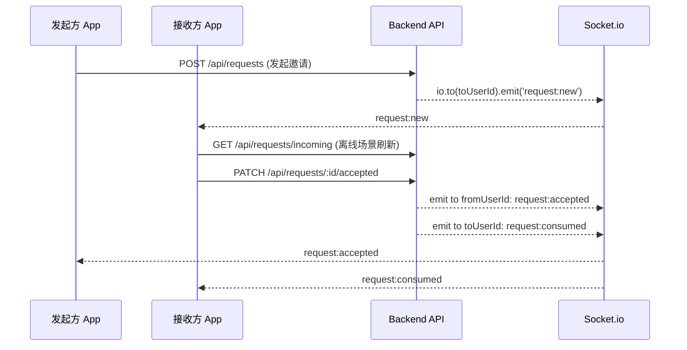

# Request 功能端到端流程说明

本文档梳理“邀请/请求（request）”功能从前端到后端的完整链路：数据流、事件、关键代码位置与常见问题，便于后续维护与扩展。

## 目标与术语

- **目标**: 实现 A→B 的邀请流程，并保证实时性（在线推送）与可靠性（离线可拉取）。
- **请求状态**: `pending` | `accepted` | `rejected` | `cancelled`。
- **实时事件（Socket）**: 以 `request:*` 命名空间组织。

## 关键文件索引

- 事件定义
  - `trace-zone/events/requestEvents.ts`
- Socket 客户端
  - `trace-zone/shared/lib/socket.ts`
  - `trace-zone/features/requests/hooks/useRequestSocket.ts`
- 前端状态与 API
  - `trace-zone/features/requests/store/useRequestStore.ts`
  - `trace-zone/features/requests/api/requestApi.ts`
- 前端页面
  - `trace-zone/app/message.tsx`
- 后端（Node + Socket.io + Mongoose）
  - `trace-zone-backend/server.js`（全局 Socket 鉴权中间件）
  - `trace-zone-backend/socket/requestSocket.js`（连接后将用户加入房间）
  - `trace-zone-backend/controllers/requestController.js`（请求的 REST 控制器）

## 事件协议（双端对齐）

前端常量（`trace-zone/events/requestEvents.ts`）

```ts
export const REQUEST_EVENTS = {
  NEW: 'request:new',
  CANCELLED: 'request:cancelled',
  CONSUMED: 'request:consumed',
  ACCEPTED: 'request:accepted',
  REJECTED: 'request:rejected',
} as const
```

后端发送事件点（`requestController.js`）：

- 发起邀请成功 → 给接收方房间：`request:new`
- 接收方接受 → 给发起方：`request:accepted`；给接收方：`request:consumed`
- 接收方拒绝 → 给发起方：`request:rejected`；给接收方：`request:consumed`
- 发起方取消 → 给接收方：`request:cancelled`

## 前端流程

### 1) Socket 初始化与鉴权

- 位置：`trace-zone/shared/lib/socket.ts`
- 从 `useAuthStore` 读取 `userId` 与 `token`，作为 `extraHeaders` 发送至后端进行 Socket 鉴权：
  - `x-user-id: <userId>`
  - `Authorization: Bearer <token>`

后端在 `server.js` 的 `io.use` 中校验并将 `socket.userId` 注入，随后在 `requestSocket.js` 将 socket 加入以 `userId` 命名的“个人房间”。

### 2) 监听请求事件并更新本地 Store

- 位置：`trace-zone/features/requests/hooks/useRequestSocket.ts`
- 监听并处理：
  - `request:new` → `useRequestStore.addRequest`
  - `request:cancelled` → `useRequestStore.removeRequestById`
  - `request:consumed` → `useRequestStore.removeRequestById`
  - `request:accepted` → `useUserStore.setSentRequest(null)`
- 初始化时会触发 `fetchRequests()` 从后端拉取当前用户的 `pending` 请求，保证离线时数据也能同步。

注意：`useRequestSocket` 内部也从 `useAuthStore` 读取 `userId/token` 用作副作用依赖，避免未登录时错误订阅。

### 3) Store 的职责与未读数

- 位置：`trace-zone/features/requests/store/useRequestStore.ts`
- 职责：
  - 维护 `requests` 列表
  - 维护 `unreadCount`
  - `fetchRequests()` 首次/刷新拉取
  - `addRequest()`/`removeRequestById()` 对应 socket 事件
  - `markAllAsRead()` 与 `calculateUnreadCount()`：
    - 使用 `AsyncStorage` 的 key `read_request_ids` 持久化“已读的 requestId 列表”
    - 每次变更后重新计算 `unreadCount`

另有便捷方法：`features/requests/hooks/useUnreadCount.ts` 提供 `useUnreadCount()` 与 `markAllAsRead()`，用于 UI 场景快速消费。

### 4) 页面展示与交互

- 位置：`trace-zone/app/message.tsx`
- 展示：使用 `useRequestStore(state => state.requests)` 渲染列表。
- 标记已读：在 `requests` 变化时调用 `markAllAsRead(requests)`。
- 下拉刷新：`getPendingRequestsForUser()` → `setRequests()` → `markAllAsRead(latest)`。
- 操作：
  - 接受：
    1) 先调用 `fetchRequestById` 二次校验状态
    2) `respondToRequest(id, 'accepted', myNameInSpace)`
    3) 本地将该请求从列表移除，并调用 `useUserStore.updateSpaceStatus()`
    4) 跳转到 `/space-home`
  - 拒绝：`respondToRequest(id, 'rejected')` → 从列表移除

## 后端流程

### 1) Socket 鉴权与房间

- 位置：`trace-zone-backend/server.js`
  - `io.use` 中根据 header 执行 `verifyToken(userId, token)`，失败则拒绝连接
  - 成功则 `socket.userId = userId`
- 位置：`trace-zone-backend/socket/requestSocket.js`
  - `connection` 后 `socket.join(userId)`，用于点对点推送

### 2) REST 控制器（核心）

- 位置：`trace-zone-backend/controllers/requestController.js`
- 主要接口：
  - `POST /api/requests`（发起）
    - 多重校验（邀请码、目标用户、是否已有空间/挂起请求）
    - `JoinRequest.create` → `io.to(toUserId).emit('request:new', { request })`
  - `GET /api/requests/incoming`（接收方列表）
    - 查询当前用户 `toUserId` 且 `status=pending`
  - `GET /api/requests/sent`（发起方挂起）
  - `GET /api/requests/:id`（详情）
  - `PATCH /api/requests/:id/accepted`（接收）
    - 校验、更新状态、创建空间、清理冲突请求
    - 推送：`fromUserId → request:accepted`，`toUserId → request:consumed`
  - `PATCH /api/requests/:id/rejected`（拒绝）
    - 推送：`fromUserId → request:rejected`，`toUserId → request:consumed`
  - `DELETE /api/requests/:id`（发起方取消）
    - 推送：`toUserId → request:cancelled`

## 时序图（简化）



## 常见问题与调试

- Socket 未收到事件：
  - 检查 `shared/lib/socket.ts` 是否携带 `x-user-id/Authorization`
  - 后端 `server.js` 是否通过 `verifyToken`
  - `requestSocket.js` 是否成功 `join(userId)`
- 列表不更新：
  - 是否订阅了 `useRequestSocket`（页面或全局 Provider 注入）
  - 查看 `useRequestStore.fetchRequests()` 是否成功调用
- 未读数不变：
  - 确认 `AsyncStorage` 的 `read_request_ids` 是否更新

## 扩展建议

- 事件去重：后端事件可能与轮询结果重叠，可在 `addRequest` 中按 `_id` 去重。
- 失败回滚：接受/拒绝失败时，考虑恢复 UI 状态或全量刷新列表。
- 通知系统：结合系统通知（Push）改善离线提醒。